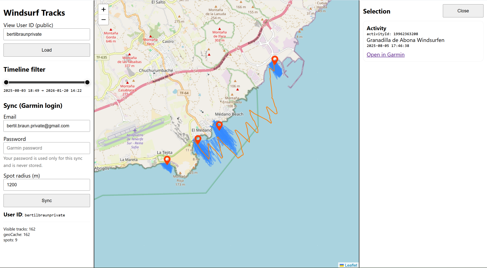

# Garmin GPS Visualizer

View, filter, and inspect Garmin activities on an interactive map. Sync your account, browse “spots”, and use the timeline slider to quickly narrow what’s shown.

Live demo: https://garmin-gps-visualizer-409522883519.europe-west1.run.app/

## How to use

1. Start the app (see `SETUP.md`).
2. Open the UI in your browser.
3. To sync new activities: enter your Garmin email + password and click **Sync**.
4. To view an existing user: enter a **View User ID** and click **Load**.
   - You can also deep-link directly: `/?uid=MYUSERID`
5. Use the **Timeline filter** to limit what’s rendered on the map.
6. Click a spot marker to list activities for that spot; click an activity in the right panel (or a track on the map) to highlight it.
